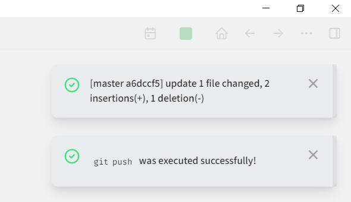
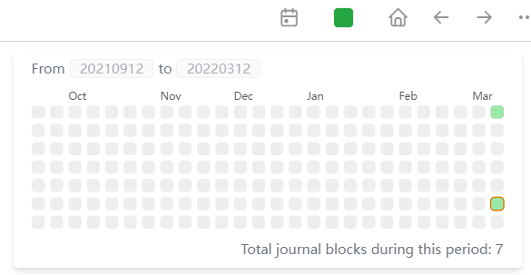

- 似乎在这里写卡片也是挺好的，很顺手，也有完整的标签体系，不过没有多层级标签，似乎问题也不大。甚至有个card体系，用来回忆使用，感觉很符合。要不要用起来呢？让我想一想。
- 而且在几次更新后logseq本身的输入体验也很好，中文标点也能引导了。而且装了vim插件后，类vim的操作体验也很好，让我找到当年的感觉。
- 如果有需要的话，还可以发布到网站上，在github上配置好了action，push上去就行。
- 有内置的git命令行，我加了一个git acp的一键alias，很方便。
  
- 热力图也有呢
  
- 日常想到的问题或点子，可以就放在当天的日记下：
- 甚至可以块引用，便于灵活组织卡片。在写专题文章前，打个大纲时非常有用。下次尝试。
- 标签略微偏简单，没有多层级标签，但也够用了，一个标签其实就是一个页面。