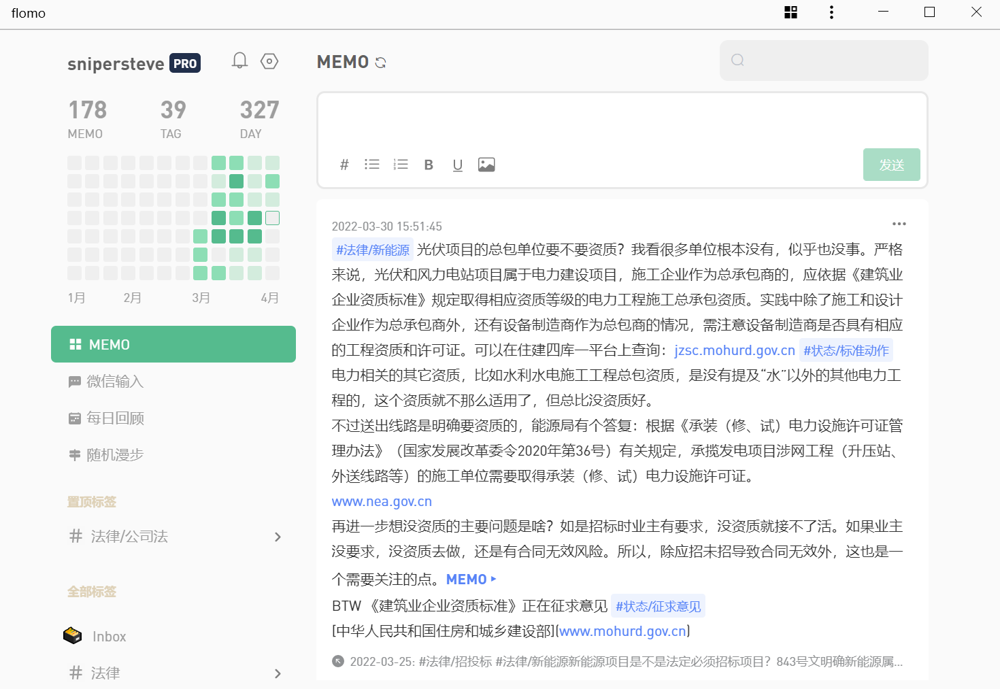

- I am a [:ruby [:rb "senior"] [:rp "("] [:rt {:style {color "var(--ct-warning-color)"}} "中年"][:rp ")"]] lawyer.
- 在这里主要作一些 [[阅读记录]] 。更多是流水，而非心得。
- 原本受 [[卡片笔记写作法]] 这书本的启发，是打算在这里写卡片的。
- > 卡片写作的典型工作流是这样的：阅读并记笔记；对卡片盒中的笔记建立关联，这个过程又会激发你新的想法；记下这些想法，并将它们添加到讨论中；写到纸上时，你又发现论点中有一个漏洞，于是到卡片笔记系统中去查找缺失的链接；你关注到一个脚注，细加研究，可能会为正在写的论文中加上一条合适的引用。 #[[卡片笔记写作法]]
- 所以说卡片笔记要求独立、完整、标准化，并且统一归口，混在书摘里并不是好的做法，所以主卡片还是放在flomo吧，标注来源即可。在logseq里可以涂涂画画、作些批注，这大约算是文献笔记，主要用途是备查。
  id:: 62391fc8-48b3-498a-818c-4f3bd0d81647
- flomo深度用了差不多一个月，有一个心得，就某个主题，第一个卡片定义为主题卡片，后面关于这个主题的卡片都关联到这个主题卡片，而不要你关联我我关联他，太乱。这个串的顺序是看你添加关联的时间，非常合理，这个产品还是很有深度的。在后面找某个主题时的最快方案是搜索，搜到任何一条通过关联关系就能迅速把这一串主题都拉出来，==一把梭==，效率最高。
- 
- 配置好logseq通过github-action发布到pages或是vercel之后非常方便，其实平日里的一些点滴，也可以写在这里，当个轻博客用。
- 好多年过去，我已经忘记logseq怎么发布了（尴尬